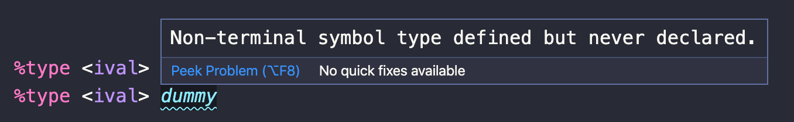
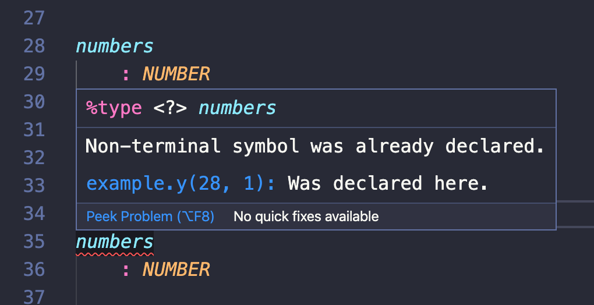
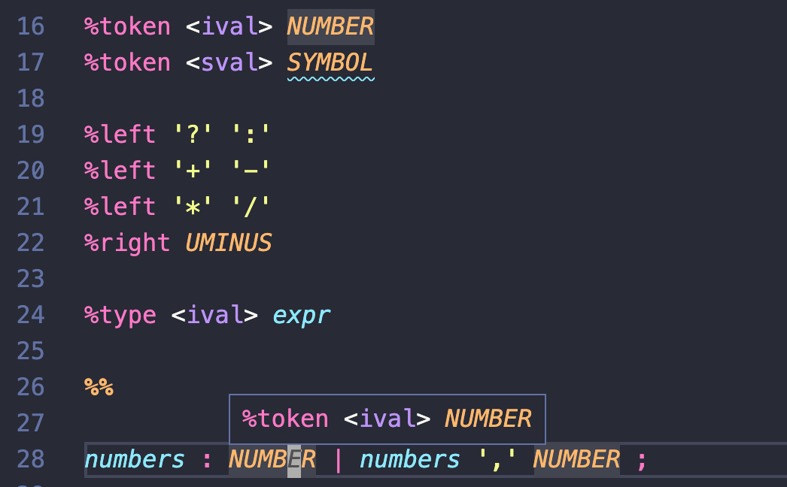
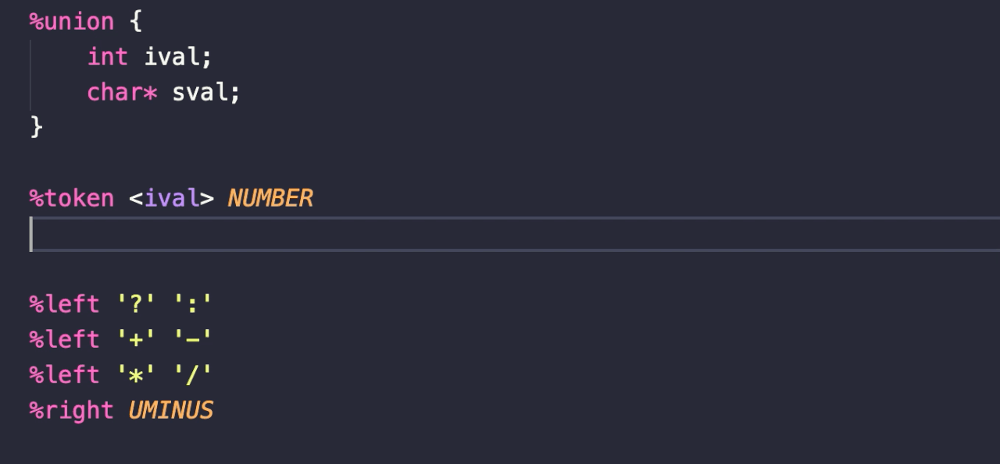
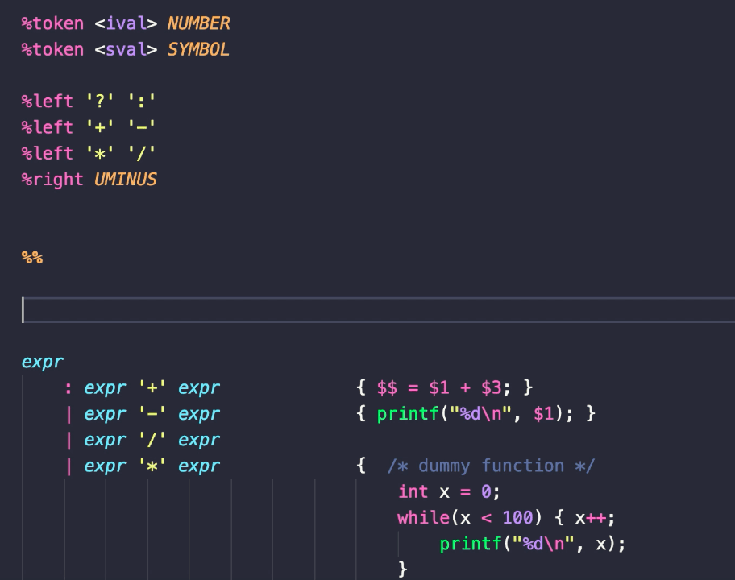

# Feature examples
## Diagnostics

## Hover

## Auto-Completion for keywords, declared definitions in lex/flex

## Auto-Completion for keywords, declared union types in yacc/bison

## Auto-Completion for symbols in yacc/bison

## Auto-Completion for symbol type in yacc/bison
